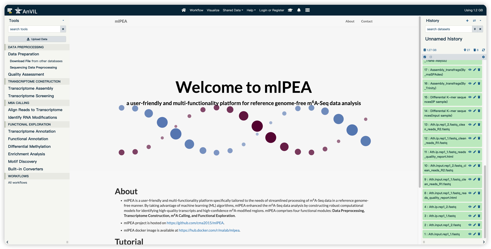

<div align='center' >
<p><font size='70'><strong>mlPEA User Manual</strong></font></p>
<font size='100'>(version 1.0)</font>
</div>

- mlPEA is a user-friendly and multi-functionality platform specifically tailored to the needs of streamlined processing of m<sup>6</sup>A-Seq data in a reference genome-free manner. By taking advantage of machine learning (ML) algorithms, mlPEA enhanced the m<sup>6</sup>A-Seq data analysis by constructing robust computational models for identifying high-quality transcripts and high-confidence m<sup>6</sup>A-modified regions.
- mlPEA comprises four functional modules: **Data Preprocessing, Transcriptome Construction, m<sup>6</sup>A Calling, and Functional Exploration**.
- mlPEA was powered with an advanced packaging technology, which enables compatibility and portability.
- mlPEA project is hosted on http://github.com/cma2015/mlPEA
- mlPEA docker image is available at http://hub.docker.com/r/malab/mlpea

## mlPEA installation

- **Step 1**: Docker installation

  **i) Docker installation and start ([Official installation tutorial](https://docs.docker.com/install))**

  For **Windows (Only available for Windows 10 Prefessional and Enterprise version):**

  - Download [Docker](https://download.docker.com/win/stable/Docker for Windows Installer.exe) for windows;
  - Double click the EXE file to open it;
  - Follow the wizard instruction and complete installation;
  - Search docker, select **Docker for Windows** in the search results and click it.

  For **Mac OS X (Test on macOS Sierra version 10.12.6 and macOS High Sierra version 10.13.3):**

  - Download [Docker](https://download.docker.com/mac/stable/Docker.dmg) for Mac OS;

  - Double click the DMG file to open it;
  - Drag the docker into Applications and complete installation;
  - Start docker from Launchpad by click it.

  For **Ubuntu (Test on Ubuntu 18.04 LTS):**

  - Go to [Docker](https://download.docker.com/linux/ubuntu/dists/), choose your Ubuntu version, browse to **pool/stable** and choose **amd64, armhf, ppc64el or s390x**. Download the **DEB** file for the Docker version you want to install;

  - Install Docker, supposing that the DEB file is download into following path:**"/home/docker-ce~ubuntu_amd64.deb"**

    ```shell
      $ sudo dpkg -i /home/docker-ce<version-XXX>~ubuntu_amd64.deb      
      $ sudo apt-get install -f
    ```

​	**ii) Verify if Docker is installed correctly**

​	Once Docker installation is completed, we can run `hello-world` image to verify if Docker is installed correctly. Open terminal in Mac OS X and Linux operating system and open CMD for Windows operating system, then type the following command:

```shell
 $ docker run hello-world
```

**Note:** root permission is required for Linux operating system.

- **Step 2**: mlPEA installation from Docker Hub

```shell
# pull latest mlpea Docker image from docker hub
$ docker pull malab/mlpea
```

- **Step 3**: Launch mlPEA local server

```shell
$ docker run -it -p 880:8080 malab/mlpea bash
$ bash /home/galaxy/run.sh
```

Then, mlPEA local server can be accessed via [http://localhost:8080](http://localhost:8080/)



