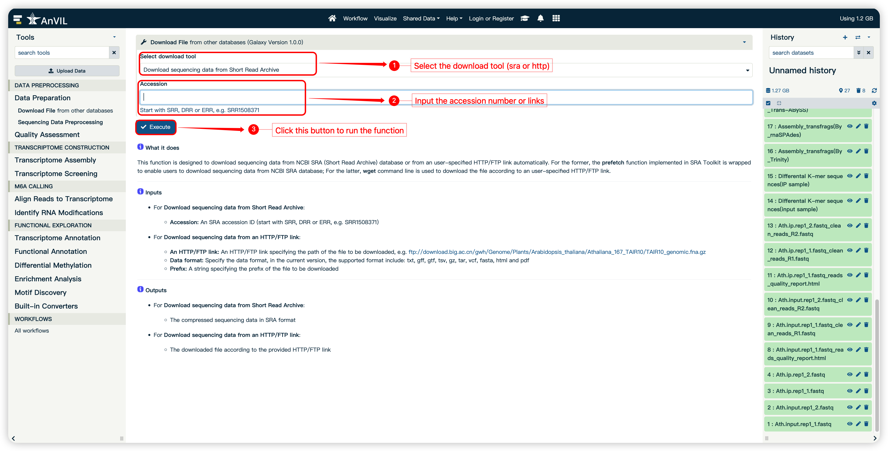

<strong>mlPEA User Manual</strong>

(version 1.0)

- mlPEA is a user-friendly, full-functionality pipeline specifically designed to enhance the processing, analysis, and interpretation of m6A-Seq in non-model plants by leveraging machine learning.
- mlPEA comprises four functional modules: **Data Preprocessing, Transcriptome Construction, m6A Calling, and Functional Exploration**.
- mlPEA was powered with an advanced  packaging technology, which enables compatibility and portability.
- mlPEA project is hosted on http://github.com/cma2015/mlPEA
- mlPEA docker image is available at http://hub.docker.com/r/malab/mlpea

## Data Preprocessing Module

This module provides four funcitons (see following table for details) to prepare epitranscriptome data.

| **Tools**                         | **Description**                                              | **Input**                                                    | **Output**                                                   | **Time (test data)**         | **Reference**                                                |
| --------------------------------- | ------------------------------------------------------------ | ------------------------------------------------------------ | ------------------------------------------------------------ | ---------------------------- | ------------------------------------------------------------ |
| **Download File**                 | Directly fetch epitranscriptome sequencing reads from NCBI's SRA database or other databases | SRR accession or HTTP/FTP link                               | Sequencing reads in SRA format                               | Depends on the network speed | <a href="https://github.com/ncbi/sra-tools" target="_blank">SRA Toolkit</a> |
| **Sequence Data Preprocessing**   | Convert epitranscriptome sequencing reads from SRA to FASTQ format | Epitranscriptome sequencing reads in SRA format              | Epitranscriptome sequencing reads in FASTQ format            | ~2 mins                      | <a href="https://github.com/ncbi/sra-tools" target="_blank">SRA Toolkit</a> |
| **Assess Reads Quality**          | Check m 6A-Seq reads quality and obtain high-quality reads | m 6A-Seq reads in FASTQ format and adapter sequences in FASTA format | m 6A-Seq reads in FASTQ format;multiQC report in HTML | ~2 mins                      | <a href="https://github.com/OpenGene/fastp" target="_blank">fastp</a>;<a href="http://multiqc.info" target="_blank">MultiQC</a> |
| **Differential *K*-mer Analyses** | Perform m 6A-Seq differential *k*-mer analyses    | m 6A-Seq reads in FASTQ format                    | m 6A-Seq reads in FASTA format                    | Depends on the file size     | <a href="https://github.com/tlemane/kmdiff" target="_blank">kmdiff</a> |

## Download File

This function is designed to download epitranscriptome sequencing reads from NCBI SRA (Short Read Archive) database or from an user-specified HTTP/FTP link automatically. For the former, the **prefetch** function implemented in <a href="https://github.com/ncbi/sra-tools" target="_blank">SRA Toolkit</a> is wrapped to enable users to download sequencing data from NCBI SRA database; For the latter, **wget** command line is used to download the file according to an user-specified HTTP/FTP link.

#### Input

- For **Download sequencing data from Short Read Archive**:

	- **Accession:** An SRA accession ID (start with SRR, DRR or ERR, e.g. SRR1508371)

- For **Download sequencing data from an HTTP/FTP link**:
	- **An HTTP/FTP link**: An HTTP/FTP link specifying the path of the file to be downloaded, e.g. ftp://download.big.ac.cn/gwh/Genome/Plants/Arabidopsis_thaliana/Athaliana_167_TAIR10/TAIR10_genomic.fna.gz
  - **Data format**: Specify the data format, in the current version, the supported format include: txt, gff, gtf, tsv, gz, tar, vcf, fasta, html and pdf
  - **Prefix**: A string specifying the prefix of the file to be downloaded
  

#### Output
- For **Download sequencing data from Short Read Archive**:
	- The compressed sequencing data in SRA format
- For **Download sequencing data from an HTTP/FTP link**:
	- The downloaded file according to the provided HTTP/FTP link

#### How to use this function

- The following screenshot shows us how to download sequencing reads in SRA format

## Sequence Data Preprocessing

This function wrapped **fastq-dump** function implemented in SRA Toolkit. See http://trace.ncbi.nlm.nih.gov/Traces/sra/sra.cgi?view=software for details.

#### Input

- **Input sra file:** The sequenceing reads in SRA format. Users can upload their local SRA file or download SRA by function **Download File** in **Data Preparation** module

#### Output

- Sequencing dataset in FASTQ format

#### How to use this function

- The following screenshot shows us how to use this function to convert sequencing reads in SRA format to FASTQ format

## **Differential *K*-mer Analyses**

In this function, two existing NGS tools MultiQC and fastp are integrated to check sequencing reads quality and obtain high-quality reads, respectively.

#### Input

- **Input FASTQ file:** single-end or paired-end raw epitranscriptome sequence reads in FASTQ format
- **Adapter sequences:** optional, adapter sequences in FASTA format

#### Output

- **Clean reads in FASTQ format**
- **Clean reads MultiQC report in HTML format**

#### How to use this function

- The following screenshot shows us how to use this function to check m 6A-Seq reads quality and obtain high-quality reads.

## **Assess Reads Quality**

In this function, one existing disk-based program kmdiff is integrated to count k-mers from (possibly gzipped) FASTQ/FASTA files.

#### Input

- **Input FASTQ file:** IP and Input cleaned epitranscriptome sequence reads in FASTQ format

#### Output

- **Differental K-mer sequences(input sample) in FASTA format**
- **Differental K-mer sequences(IP sample) in FASTA format**

#### How to use this function

- The following screenshot shows us how to use this function.

