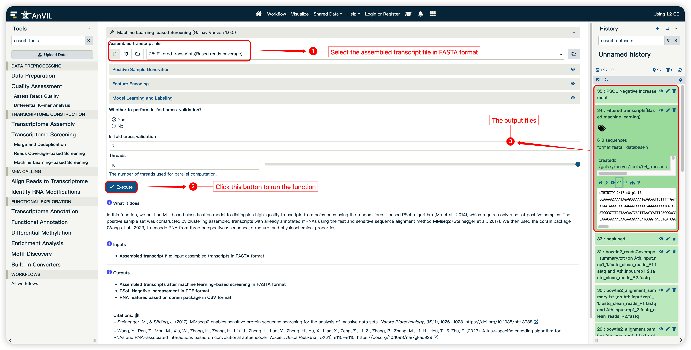

<strong>mlPEA User Manual</strong>

(version 1.0)

- mlPEA is a user-friendly, full-functionality pipeline specifically designed to enhance the processing, analysis, and interpretation of m6A-Seq in non-model plants by leveraging machine learning.
- mlPEA comprises four functional modules: **Data Preprocessing, Transcriptome Construction, m6A Calling, and Functional Exploration**.
- mlPEA was powered with an advanced  packaging technology, which enables compatibility and portability.
- mlPEA project is hosted on http://github.com/cma2015/mlPEA
- mlPEA docker image is available at http://hub.docker.com/r/malab/mlpea

## Transcriptome Construction Module

This module provides step-by-step functions required for transcriptome construction.

#### Transcriptome Assembly

Several commonly used trascriptome assemblers are wrapped to use. Currently, **Trinity**, **rnaSPAdes**,**TransABySS**,**TransLiG**.

| **Tools**      | **Description**                                              | **Input**                        | **Output**                    | **Time (test data)** | **Reference**               |
| -------------- | ------------------------------------------------------------ | -------------------------------- | ----------------------------- | -------------------- | --------------------------- |
| **Trinity**    | Trinity partitions the sequence data into many individual de Bruijn graphs, each representing the transcriptional complexity at a given gene or locus, and then processes each graph independently to extract full-length splicing isoforms and to tease apart transcripts derived from paralogous genes. | Sequencing reads in FASTQ format | Transcripts   in FASTA format | ~5 mins              | (Grabherr *et al*., 2011)   |
| **rnaSPAdes**  | SPAdes is primarily developed for Illumina sequencing data, but can be used for IonTorrent as well. Most of SPAdes pipelines support hybrid mode, i.e. allow using long reads (PacBio and Oxford Nanopore) as a supplementary data. | Sequencing reads in FASTQ format | Transcripts   in FASTA format | ~5 mins              | (Prjibelski *et al*., 2020) |
| **TransABySS** | a *de novo* short-read transcriptome assembly and analysis pipeline that addresses variation in local read densities by assembling read substrings with varying stringencies and then merging the resulting contigs before analysis. | Sequencing reads in FASTQ format | Transcripts   in FASTA format | ~5 mins              | (Robertson *et al*., 2010)  |
| **TransLiG**   | TransLiG is shown to be significantly superior to all the salient de novo assemblers in both accuracy and computing resources when tested on artificial and real RNA-seq data. | Sequencing reads in FASTQ format | Transcripts   in FASTA format | ~5 mins              | (Liu *et al*., 2019)        |

#### Transcriptome Screening

**Transcriptome screening** implements three pipelines for transcripts deduplication, respectively.

| **Tools**                            | **Description**                                              | **Input**                                    | **Output**                    | **Time (test data)** | **Reference**                                                |
| ------------------------------------ | ------------------------------------------------------------ | -------------------------------------------- | ----------------------------- | -------------------- | ------------------------------------------------------------ |
| **Merge and Deduplication**          | a novel program CD-HIT (Fu *et al*., 2012) for clustering biological sequences to reduce sequence redundancy and improve the performance of other sequence analyses. | multiple Transcripts  files  in FASTA format | Transcripts   in FASTA format | ~5 mins              | (Fu *et al*., 2012)                                          |
| **Reads Coverage Screening**         | an ultrafast and memory-efficient tool **Bowtie 2** (Langmead *et al*., 2009; Langmead *et al*., 2012) for aligning sequencing reads, reads coverage was measured by **SAMtools** (Danecek *et al*., 2021) and **BEDTools** (Quinlan *et al*., 2010). | Transcripts   in FASTA format                | Transcripts   in FASTA format | ~10 mins             | (Langmead *et al*., 2009; Langmead *et al*., 2012)(Danecek *et al*., 2021)(Quinlan *et al*., 2010) |
| **Machine Learning-based Screening** | MMSeq2 (Steinegger *et al*., 2017) to cluster the assembled transfrags with both mRNA and ncRNA sequences from the Ensembl Plants across all plant species. Both assembled tranfrags and annotated plant sequences to serve as positive sample set. Then we used the corain package (Wang *et al*., 2023) to encode for RNA from three perspectives, sequence, structure and physical chemical properties. Adopted the improved PSoL(IPSol) algorithm (Wang *et al*., 2006), the initial negative samples were generated from "unlabeled" sample set based on the PU bagging algorithm, the expanded negative samples iteratively using RF classifier until the designated iteration number was reached. | Transcripts   in FASTA format                | Transcripts   in FASTA format | ~20mins              | (Steinegger *et al*., 2017)(Wang *et al*., 2023)(Wang *et al*., 2006) |

## Transcriptome Assembly

Currently, mlPEA wrapped four assemblers to *de nove* assemble transcripts, here, we take Trinity as an example to show how to use mlPEA to run transcriptome assembly, the other three assemblers are similar.

#### Input

- **Input FASTQ files:** Input cleaned sequence reads in FASTQ format

#### Output
- **de novo transcriptome assembly by Trinity in FASTA format**

#### How to use this function

- The following screenshot shows us how to use this function

## **Merge and Deduplication** 

In this function, a novel program CD-HIT (Fu *et al*., 2012) for clustering biological sequences to reduce sequence redundancy and improve the performance of other sequence analyses.

#### Input

- **Input FASTA files:** Input assembled transcripts in FASTA format

#### Output

- **Transcripts after deduplication in FASTA format**

#### How to use this function

- The following screenshot shows us how to use this function

## **Reads Coverage Screening**

In this function,  we developed a pipline for screening transcripts based on reads coverage. **Bowtie 2** (Langmead *et al*., 2009; Langmead *et al*., 2012) for aligning sequencing reads, reads coverage was measured by **SAMtools** (Danecek *et al*., 2021) and **BEDTools** (Quinlan *et al*., 2010).

#### Input

- **Input FASTQ files:** Input cleaned sequence reads in FASTQ format

#### Output

- **de novo transcriptome assembly by Trinity in FASTA format**

#### How to use this function

- The following screenshot shows us how to use this function

## **Machine Learning-based Screening**

In this function,  we developed a pipline for screening transcripts based on machine learning. **MMSeq2** (Steinegger *et al*., 2017) to cluster the assembled transfrags with both mRNA and ncRNA sequences from the Ensembl Plants across all plant species. Both assembled tranfrags and annotated plant sequences to serve as positive sample set. Then we used the **corain** package (Wang *et al*., 2023) to encode for RNA from three perspectives, sequence, structure and physical chemical properties. Adopted the **PSoL** algorithm (Wang *et al*., 2006), the initial negative samples were generated from "unlabeled" sample set based on the PU bagging algorithm, the expanded negative samples iteratively using RF classifier until the designated iteration number was reached.

#### Input

- **Input FASTQ files:** Input cleaned sequence reads in FASTQ format

#### Output

- **Filtered transcripts with machine learning in FASTA format**
- **PSOL Negative Increasement in PDF format**
- **RNA features based on corain package in CSV format**

#### How to use this function

- The following screenshot shows us how to use this function

