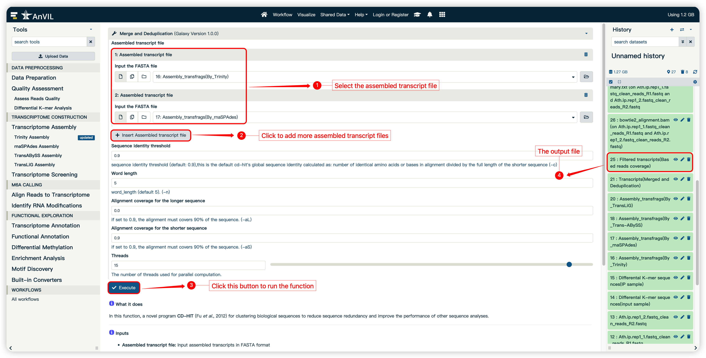

<strong>mlPEA User Manual</strong>

(version 1.0)

- mlPEA is a user-friendly and multi-functionality platform specifically tailored to the needs of streamlined processing of m6A-Seq data in a reference genome-free manner. By taking advantage of machine learning (ML) algorithms, mlPEA enhanced the m6A-Seq data analysis by constructing robust computational models for identifying high-quality transcripts and high-confidence m6A-modified regions.
- mlPEA comprises four functional modules: **Data Preprocessing, Transcriptome Construction, m6A Calling, and Functional Exploration**.
- mlPEA was powered with an advanced packaging technology, which enables compatibility and portability.
- mlPEA project is hosted on http://github.com/cma2015/mlPEA
- mlPEA docker image is available at http://hub.docker.com/r/malab/mlpea

## Transcriptome Construction Module

This module provides step-by-step functions required for transcriptome construction.

#### Transcriptome Assembly

Four assemblers that support strand-specific m6A-Seq data are wrapped to use. Currently, **Trinity**, **rnaSPAdes**, **TransABySS**, **TransLiG**.

| **Tools**      | **Description**                                              | **Input**                        | **Output**                    | **Time (test data)** | **Reference**               |
| -------------- | ------------------------------------------------------------ | -------------------------------- | ----------------------------- | -------------------- | --------------------------- |
| **Trinity**    | Trinity partitions the sequence data into many individual de Bruijn graphs, each representing the transcriptional complexity at a given gene or locus, and then processes each graph independently to extract full-length splicing isoforms and to tease apart transcripts derived from paralogous genes. | Sequencing reads in FASTQ format | Transcripts   in FASTA format | ~4 mins              | (Grabherr *et al*., 2011)   |
| **rnaSPAdes**  | rnaSPAdes has been developed on top of the SPAdes genome assembler and explores computational parallels between assembly of transcriptomes and single-cell genomes. | Sequencing reads in FASTQ format | Transcripts   in FASTA format | ~3 mins              | (Prjibelski *et al*., 2020) |
| **TransABySS** | A *de novo* short-read transcriptome assembly and analysis pipeline that addresses variation in local read densities by assembling read substrings with varying stringencies and then merging the resulting contigs before analysis. | Sequencing reads in FASTQ format | Transcripts   in FASTA format | ~5 mins              | (Robertson *et al*., 2010)  |
| **TransLiG**   | TransLiG is shown to be significantly superior to all the salient *de novo* assemblers in both accuracy and computing resources when tested on artificial and real RNA-seq data. | Sequencing reads in FASTQ format | Transcripts   in FASTA format | ~4 mins              | (Liu *et al*., 2019)        |

#### Transcriptome Screening

**Transcriptome screening** implements three pipelines for transcripts deduplication, respectively.

| **Tools**                            | **Description**                                              | **Input**                                    | **Output**                    | **Time (test data)** | **Reference**                                                |
| ------------------------------------ | ------------------------------------------------------------ | -------------------------------------------- | ----------------------------- | -------------------- | ------------------------------------------------------------ |
| **Merge and Deduplication**          | A novel program CD-HIT for clustering biological sequences to reduce sequence redundancy and improve the performance of other sequence analyses. | Multiple Transcripts  files  in FASTA format | Transcripts   in FASTA format | ~5 mins              | (Fu *et al*., 2012)                                          |
| **Reads Coverage-based Screening**   | An ultrafast and memory-efficient tool Bowtie 2 for aligning sequencing reads, reads coverage was measured by SAMtools and BEDTools. | Transcripts   in FASTA format                | Transcripts   in FASTA format | ~20 mins             | (Langmead *et al*., 2009; Langmead *et al*., 2012)(Danecek *et al*., 2021)(Quinlan *et al*., 2010) |
| **Machine Learning-based Screening** | An ML-based classification model to distinguish high-quality transcripts from noisy ones using the random forest-based PSoL algorithm, which requires only a set of positive samples. The positive sample set is constructed by clustering analysis of assembled transcripts and already annotated mRNAs using a fast and sensitive sequence alignment method MMseqs2. It provides more than 670 features to encode each transcript sequence. | Transcripts   in FASTA format                | Transcripts   in FASTA format | ~10mins              | (Steinegger *et al*., 2017)(Wang *et al*., 2023)(Wang *et al*., 2006) |

## Transcriptome Assembly

Currently, mlPEA wrapped four assemblers that support strand-specific m6A-Seq data to *de nove* assemble transcripts. Here, we take Trinity as an example to show how to use mlPEA to run transcriptome assembly, the other three assemblers are similar.

#### Input

- **Input FASTQ files:**  cleaned m6A-Seq input reads in FASTQ format

#### Output
- ***De novo* assembled transcripts by Trinity in FASTA format**

#### How to use this function

- The following screenshot shows us how to use this function

## **Merge and Deduplication** 

In this function, a novel program **CD-HIT** for clustering biological sequences to reduce sequence redundancy and improve the performance of other sequence analyses.

#### Input

- **Input FASTA files:** assembled transcripts in FASTA format

#### Output

- **Transcripts after deduplication in FASTA format**

#### How to use this function

- The following screenshot shows us how to use this function

## **Reads Coverage-based Screening**

In this function,  we developed a pipline for screening transcripts based on reads coverage. **Bowtie 2** for aligning sequencing reads, reads coverage was measured by **SAMtools** and **BEDTools**.

#### Input

- **Input FASTQ files:** cleaned m6A-Seq input reads in FASTQ format

#### Output

- ***De novo* assembled transcripts in FASTA format**

#### How to use this function

- The following screenshot shows us how to use this function

## **Machine Learning-based Screening**

In this function,  an ML-based classification model to distinguish high-quality transcripts from noisy ones using the random forest-based Positive Sample only Learning (PSoL) algorithm, which requires only a set of positive samples. The positive sample set is constructed by clustering analysis of assembled transcripts and already annotated mRNAs using a fast and sensitive sequence alignment method **MMseqs2**. It provides more than 670 features to encode each transcript sequence, including 177 sequence-intrinsic features, 399 physico-chemical features and 101 structure-based features.

#### Input

- **Input FASTQ files:** *de novo* assembled transcripts in FASTA format

#### Output

- **High-quality transcripts in FASTA format**
- **PSoL Negative Increasement in PDF format**
- **RNA features based on corain package in CSV format**

#### How to use this function

- The following screenshot shows us how to use this function

