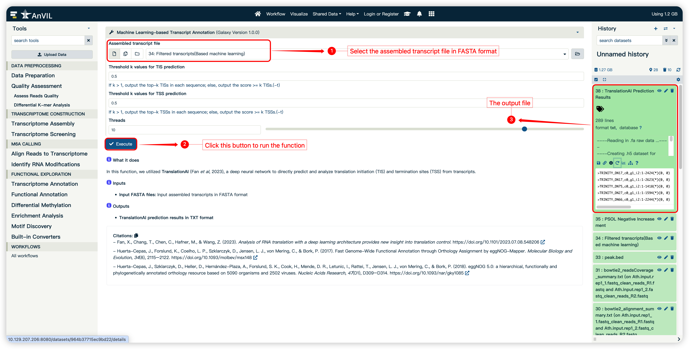
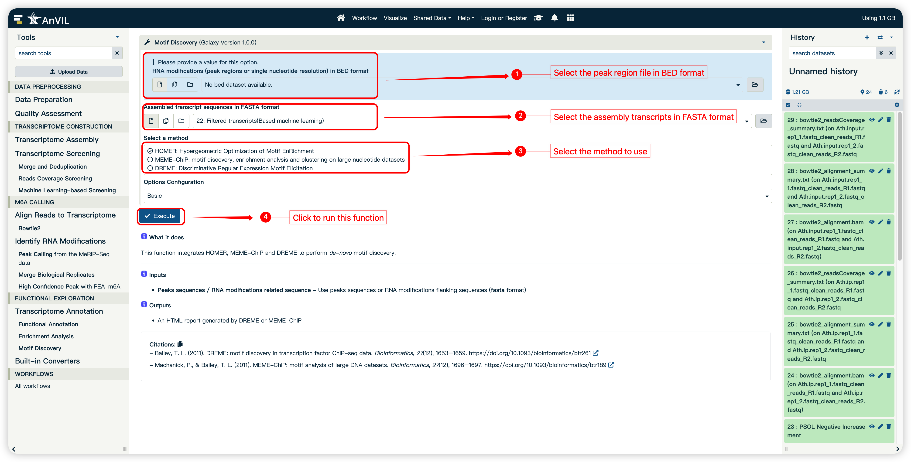

<strong>mlPEA User Manual</strong>

(version 1.0)

- mlPEA is a user-friendly and multi-functionality platform specifically tailored to the needs of streamlined processing of m6A-Seq data in a reference genome-free manner. By taking advantage of machine learning (ML) algorithms, mlPEA enhanced the m6A-Seq data analysis by constructing robust computational models for identifying high-quality transcripts and high-confidence m6A-modified regions.
- mlPEA comprises four functional modules: **Data Preprocessing, Transcriptome Construction, m6A Calling, and Functional Exploration**.
- mlPEA was powered with an advanced packaging technology, which enables compatibility and portability.
- mlPEA project is hosted on [https://github.com/cma2015/mlPEA](https://github.com/cma2015/mlPEA)
- mlPEA Docker image is available at [https://hub.docker.com/r/malab/mlpea](https://hub.docker.com/r/malab/mlpea)

## Functional Exploration

This module provided five functions to perform functional exploration of m6A-Seq data

| **Functions**                      |                       **Description**                        |                          **Input**                           |                          **Output**                          | Time  (test data) |  **Reference**   |
| ---------------------------------- | :----------------------------------------------------------: | :----------------------------------------------------------: | :----------------------------------------------------------: | ----------------- | :--------------: |
| **ML-based Transcript Annotation** |      Predict the coding region of assembled transcripts      |            Assembled transcripts in FASTA format             | Prediction scores of translation initiation and termination sites of assembled transcripts in txt format | ～3 min           | In-house scripts |
| **Function Annotation**            |         Annotate the functions of coding transcripts         | RNA modifications in BED format and assembled transcripts in FASTA format |     Functions corresponding to transcripts in txt format     | ~3 min            |                  |
| **Differential Methylation**       | Identify differential methylation modifications under multiple conditions | Assembled transcripts in FASTA format and alignment file in bam format |         RNA differential modifications in BED format         | ~5 min            | In-house scripts |
| **Enrichment Analysis**            |    Perform GO or KEGG enrichment analysis for any species    |       Transcript list and function annotation results        |                  The enriched GO/KEGG terms                  | ~3 min            |                  |
| **Motif Discovery**                | Integrate MEME-ChIP and HOMER to performed *de novo* motif discovery | RNA modifications in BED format and assembled transcriptome sequences in FASTA format |               Discovered motifs in HTML format               | ~1 min            |                  |

## ML-based Transcript Annotation

In this function, we utilized **TranslationAI**, a deep neural network to directly predict and analyze translation initiation (TIS) and termination sites (TSS) from transcripts. 

#### Input

- **Assembly transcript in FASTA format**

#### Output

- **TranslationAI prediction results in TXT format**
- **Transcripts annotation results in TXT format**

#### How to use this function

- The following screenshot shows us how to use this function.

## **Function Annotation**

In this function, functional annotation was performed useing eggNOG-mapper (database v5.0.2) to identify potential functions based on homology.

#### Input

- **Assembled transcript in FASTA format**

#### Output

- **Assembled transcripts  function annotation results in TXT format by eggNOG**

#### How to use this function

- The following screenshot shows us how to use this function.

  

## **Differential Methylation**

In this function, for pair-wised m6A-Seq data, mlPEA can identify differentially methylated regions (DMRs) using **QNB**, with the negative-binomial distribution model to capture the within-group variability of m6A methylation level across all samples.

#### Input

- **Assembled transcript in FASTA format**
- **Alignment reaults in BAM format**

#### Output

- **The differential peak region matrix in TXT format**

#### How to use this function

- The following screenshot shows us how to use this function.

  

## Enrichment Analysis

In this function, for a set of m6A-modified transcripts of interest, Kyoto Encyclopedia of Genes and Genomes (KEGG) and gene ontology (GO) enrichment analysis is performed utilizing the R package **clusterProfiler**.

#### Input

- **Assembled transcripts  function annotation results in TXT format by eggNOG**
- **RNA modifications transcript list**

#### Output

- The enriched GO/KEGG terms
- A PDF focument of top enriched GO/KEGG terms

#### How to use this function

- The following screenshot shows us how to use this function.

## Motif **Discovery**

This function integrates MEME-ChIP and HOMER to perform *de novo* motif discovery.

#### Input

- **RNA modifications regions in BED format**
- **Assembled transcript in FASTA format**

#### Output

- An HTML report generated by MEME-ChIP or HOMER

#### How to use this function

- The following screenshot shows us how to use this function.

